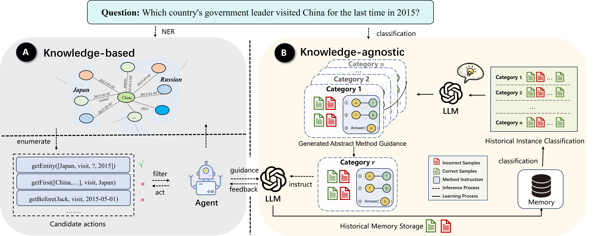
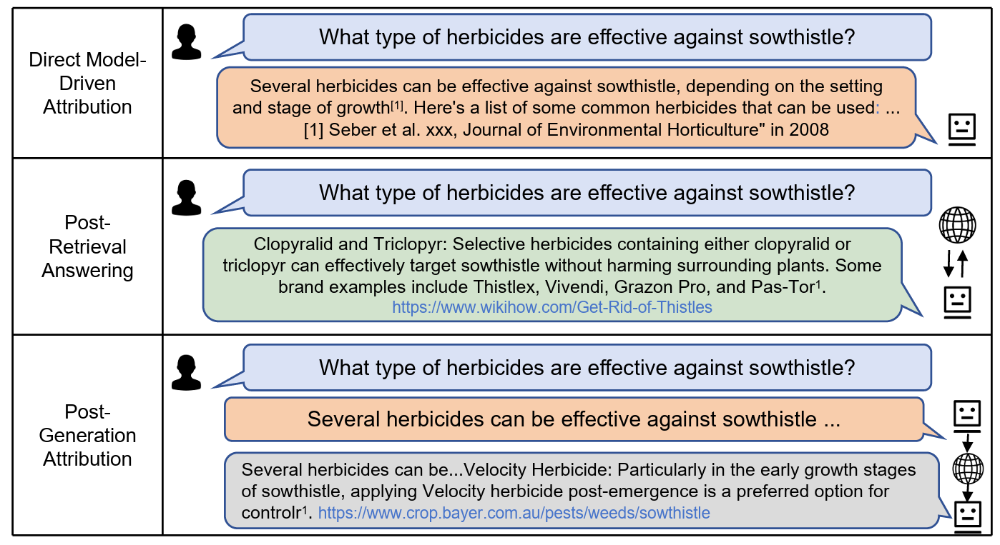
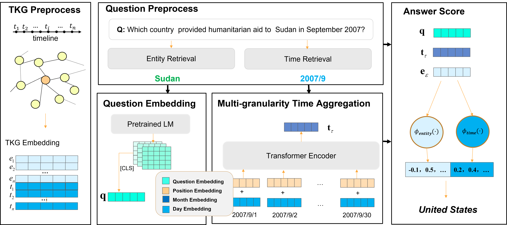
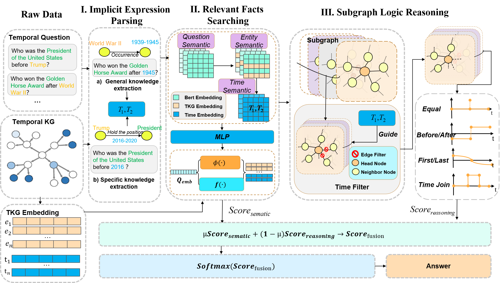

<meta name="google-site-verification" content="bktacYt7qejHyQqNeNe_78-xESn94t1Y-HZ3Fa7tlGU" />

## 😎 About Me (陈子阳)

I'm a second year Ph.D. student at [National University of Defense Technology (国防科技大学)](https://english.nudt.edu.cn/), proudly advised by Prof. [Xiang Zhao (赵翔)](https://xiangz-nudt.github.io/). My research interests focus on temporal reasoning, knowledge graph, and large language models. 

The long-term goal of my research is to develop **self-evolving** artificial intelligence that can liberate humanity from mundane tasks.<!--and contribute to the realization of communism.--> Areas of interest in research include:

- Temporal Reasoning;
- Continual Learning for Large Language models;
- Temporal Knowledge Graph;
- Multi-Agent Collaboration on Social Science Research;
- AI4Science

<ul style="color: blue;">I am actively looking for academic exchange and collaboration.</ul>
<ul style="color: blue;">📧 chenziyangnudt@nudt.edu.cn /  chenziyang319@163.com</ul>

## 🔥 News
- 2024.09: ✨One paper about Multi-Agent Scientific Hypothesis Generation is accepted by [JCRD (计算机研究与发展)](https://crad.ict.ac.cn/)!
- 2024.08: 💼Joining [Baidu Intelligent Search team](http://searchscience.baidu.com/) for a research internship, focusing on AI search!
- 2024.07: ✨One long paper and one short paper are accepted by [CIKM 2024](https://cikm2024.org/)!
- 2024.07: 🎉Invited talk on LLM Temporal Reasoning at [AI TIME](https://www.aitime.cn/)!
- 2024.05: ✨One [long paper](https://aclanthology.org/2024.acl-long.267/) about LLM Temporal Reasoning is accepted by the main conference of ACL 2024!
- 2023.07: 🎉Invited talk on TKGQA at [AIS 2023](http://site.cipsc.org.cn/qngw/)!
- 2023.05: ✨One  [long paper](https://aclanthology.org/2023.acl-long.637.pdf) on TKGQA is accepted by the main conference of ACL 2023!

## 📕 Selected Publications 

- **[ACL 2024]** Temporal knowledge question answering via abstract reasoning induction 
  <u><strong>Ziyang Chen</strong></u>, Dongfang Li, Xiang Zhao, Baotian Hu, Min Zhang
   **[[pdf](https://arxiv.org/abs/2311.09149)]**  **[[code](https://github.com/czy1999/ARI-QA)]**  

  <!--  -->

- **[arXiv 2023]** A survey of large language models attribution 
  Dongfang Li, Zetian Sun, Xinshuo Hu, Zhenyu Liu,   <u><strong>Ziyang Chen</strong></u>, Baotian Hu, Aiguo Wu, Min Zhang
   **[[pdf](https://aclanthology.org/2023.acl-long.637.pdf)]**  **[[code](https://github.com/HITsz-TMG/awesome-llm-attributions)]** 

  <!--  -->

- **[ACL 2023]** Multi-granularity temporal question answering over knowledge graphs 
   <u><strong>Ziyang Chen</strong></u>, Jinzhi Liao, Xiang Zhao
   **[[pdf](https://aclanthology.org/2023.acl-long.637.pdf)]**  **[[code](https://github.com/czy1999/MultiTQ)]**  **[[data](https://huggingface.co/datasets/chenziyang/MultiTQ)]** 

  <!--  -->

- **[KBS 2022]** Temporal knowledge graph question answering via subgraph reasoning 
  <u><strong>Ziyang Chen</strong></u>, Xiang Zhao, Jinzhi Liao, Xinyi Li, Evangelos Kanoulas
   **[[pdf](https://www.sciencedirect.com/science/article/pii/S0950705122005603)]**  **[[code](https://github.com/czy1999/SubGTR)]**
  
  <!--  -->
  

## 💼 Research Internship
- 2024.08-present: Research Intern at 
[Baidu’s Search Science Team](http://searchscience.baidu.com/), Baidu Inc.
- 2024.02-2024.08: Research Intern at [Institute for Intelligence Computing](https://tongyi.aliyun.com/) (previously [DAMO Academy](https://damo.alibaba.com/)), Alibaba Group.
- 2023.07-2024.02: Visiting Student at Harbin Institute of Technology Shenzhen (HIT-SZ), advised by Prof. [Baotian Hu (户保田)](https://faculty.hitsz.edu.cn/hubaotian).

## 💁 Service
I serve as the PC member/reviewer for
* ACL ARR (2023-), 
* NeurIPS (2024-), 
* ICLR (2024-), 
* IEEE TKDE (2024-) , 
* IEEE TNNLS (2024-), 
* AAAI (2023-), 
* CIKM (2023-), 
* Neural Networks (2024-), 
* KBS (2022-), 
* NLPCC (2024-), 
* CCKS (2022-)

## 🏅 Award
* Undergraduate National Scholarship
* Freshman First-Class Scholarship of NUDT

<!-- Google tag (gtag.js) -->

